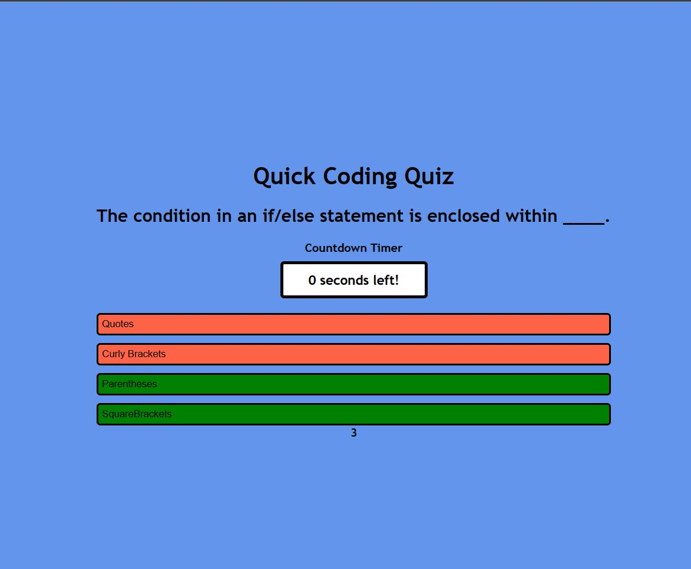

# Coding-Quiz
Quick Quiz to test JavaScript knowledge

## User-Story

This project challenged us to create a version of a coding quiz that would present a user a multiple-choice question. When the user selects an answer, it will return correct or incorrect, record a score and provide a total score at the end of the quiz.

[https://willisson7.github.io/Coding-Quiz/]